# Assignment 2: Cross-Validation, SVM, FP-Growth, K-Means + ARM

**Student ID:** 314540066

**GitHub Link:** https://github.com/Ashurali/DM2026-Assignment-1-MKS

---

# Q1. K-fold Cross-Validation (15 points)

*Notebook:* `Real_World_Classification.ipynb`

## Q1(a) 5-fold CV grid (4×4 lr × λ, L2 regularisation)

CV is run on the training set only (test set held out). Mean accuracy across the 5 folds, by configuration:

| lr \\ λ | 1 | 2 | 4 | 8 |
|:-:|:-:|:-:|:-:|:-:|
| **0.005** | 0.7186 | 0.7229 | **0.7257** | 0.5300 |
| **0.01**  | 0.7200 | **0.7286** | **0.7257** | 0.5300 |
| **0.1**   | 0.7186 | **0.7257** | **0.7257** | 0.5300 |
| **0.5**   | 0.5300 | 0.5300 | 0.5300 | 0.5300 |

CV winners: `lr=0.01, λ=2.0` (0.7286) and `lr=0.01, λ=4.0` (0.7257). Three other configs tie at 0.7257 — we evaluate all five on the held-out test set in Q1(b).

## Q1(b) Top-2 + tied configs on the test set

| Config | Train acc | Test acc | Test Precision | Test Recall | Test F1 |
|---|:-:|:-:|:-:|:-:|:-:|
| **Top 1**: lr=0.01, λ=2.0 | — | **0.7600** | 0.7381 | 0.8158 | **0.7750** |
| Top 2: lr=0.01, λ=4.0      | — | 0.7400 | 0.7176 | 0.8026 | 0.7578 |
| Tied: lr=0.005, λ=4.0      | — | 0.7533 | 0.7241 | **0.8289** | 0.7730 |
| Tied: lr=0.1,   λ=4.0      | — | 0.7400 | 0.7176 | 0.8026 | 0.7578 |
| Tied: lr=0.1,   λ=2.0      | — | 0.7533 | 0.7294 | 0.8158 | 0.7702 |

Confusion-matrix charts (Top 1 on the left, best-recall tie on the right):

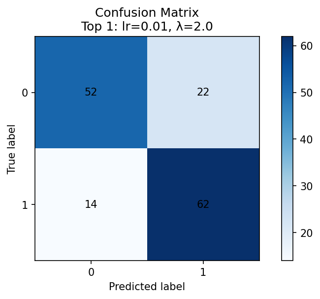{ width=48% }
{ width=48% }

## Q1(c) Observations

**On the CV step.** The 4-way tie at CV=0.7257 (λ=4 across three learning rates plus λ=2 at lr=0.1) initially suggested λ=4 gave a consistent boost. The CV winner `lr=0.01, λ=2.0` only led the runners-up by 0.0029 — within CV noise. λ=8 collapses across all learning rates (acc=0.5300, the majority-class rate) — the model is over-regularised and predicts a single class.

**On the CV → test transfer.** Three observations:
1. The CV-picked Top 1 (`lr=0.01, λ=2.0`) is best on test too (Acc 0.76, F1 0.7750). CV did transfer for the very best.
2. The CV-picked Top 2 (`lr=0.01, λ=4.0`) is actually the **worst** of the tie on test (Acc 0.74). The "consistent λ=4 boost" suggested by CV was CV-noise, not generalisation.
3. `lr=0.01, λ=4.0` and `lr=0.1, λ=4.0` produce **identical test metrics** — same converged minimum; learning rate only controls speed, not destination, given enough iterations.

**Lr-vs-recall coupling.** `lr=0.005, λ=4.0` gives the highest recall (0.8289) of any configuration. A slower learning rate combined with stronger regularisation pushes the decision boundary to predict the positive class more readily. Accuracy moves little with lr; recall is the lr-sensitive metric here.

---

# Q2. SVM on `mobile_price.csv` (15 points)

*Notebook:* `Mobile_Price_SVM.ipynb`

Data is shuffled with `random_state=42` and split 60/20/20 into train/val/test. All 20 features are kept; `price_range` is the 4-way target.

## Q2(a) `SVC(C=1.0)` baseline

| Split | Accuracy | Macro F1 |
|---|:-:|:-:|
| Train | 0.9842 | 0.9842 |
| Validation | 0.8700 | 0.8698 |
| **Test** | **0.8725** | **0.8727** |

Train-val gap of ~11.4 pts indicates moderate overfitting at C=1.0; val and test agree closely.

## Q2(b) C sweep

`C ∈ {0.001, 0.01, 0.1, 1, 10, 100, 1000, 10000}`. Results (5-fold CV on train + final test):

| C | val_acc | CV mean | CV std | test_acc |
|:-:|:-:|:-:|:-:|:-:|
| 0.001 | 0.7075 | 0.2544 | 0.0496 | 0.6625 |
| 0.01  | 0.7075 | 0.2544 | 0.0496 | 0.6625 |
| 0.1   | 0.7075 | 0.6113 | 0.0357 | 0.6625 |
| **1.0**   | **0.8700** | 0.8538 | 0.0023 | **0.8725** |
| 10.0  | 0.8500 | **0.8619** | 0.0252 | 0.8725 |
| 100.0 | 0.8500 | 0.8612 | 0.0247 | 0.8725 |
| 1000+ | 0.8500 | 0.8612 | 0.0247 | 0.8725 |

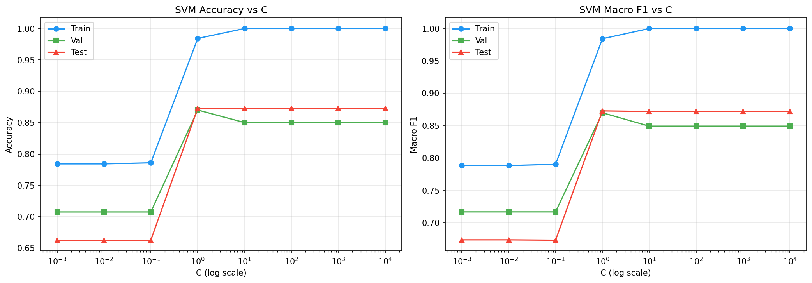

## Q2(c) Final pick

**C = 1.0** by the TA-suggested procedure (highest val_acc), **C = 10** by 5-fold CV (highest CV mean). Both deliver identical test accuracy (0.8725) — at C ≥ 1 the SVM has saturated the linearly-separable signal in the data. The conservative choice is **C = 1.0** because (a) it yields the smallest train–val gap, (b) at higher C the CV std jumps to 0.025 (10× higher than at C=1), so C=10 wins CV mean only by being lucky on average. 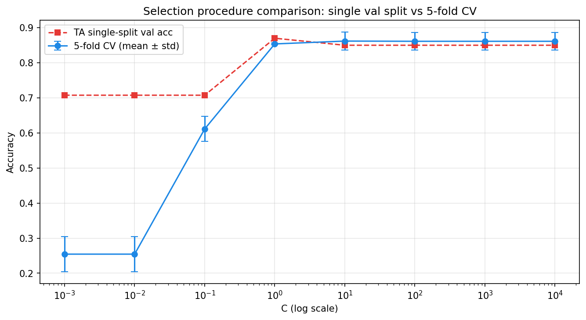

---

# Q3. Association Rule Mining (15 points)

*Notebook:* `Mobile_Price_FPgrowth.ipynb`

Subset to `price_range == 1` (500 samples). Discretise `{ram, int_memory, px_width, battery_power}` into low/medium/high using a 3:4:3 split of the value range. Build per-row transactions, then run `mlxtend.frequent_patterns.fpgrowth`.

## Q3(a) Frequent patterns (support ≥ 0.3)

8 itemsets:

| size | support | items |
|:-:|:-:|---|
| 1 | 0.682 | `ram_medium` |
| 1 | 0.416 | `px_width_medium` |
| 1 | 0.414 | `battery_power_medium` |
| 1 | 0.412 | `int_memory_medium` |
| 2 | 0.318 | `battery_power_medium`, `ram_medium` |
| 1 | 0.316 | `int_memory_low` |
| 1 | 0.308 | `battery_power_low` |
| 2 | 0.306 | `px_width_medium`, `ram_medium` |

## Q3(b) Association rules (support ≥ 0.3, confidence ≥ 0.4, lift ≥ 0.8)

4 rules:

| Antecedents | Consequents | support | confidence | lift |
|-------|-----|:-:|:-:|:-:|
| `battery_power_medium` | `ram_medium` | 0.318 | 0.7681 | 1.1263 |
| `ram_medium`           | `battery_power_medium` | 0.318 | 0.4663 | 1.1263 |
| `px_width_medium`      | `ram_medium` | 0.306 | 0.7356 | 1.0786 |
| `ram_medium`           | `px_width_medium` | 0.306 | 0.4487 | 1.0786 |

## Q3(c) Observations

In `price_range == 1` (mid-priced phones), `ram_medium` is dominant — 68.2% of these phones have RAM in the middle bucket. The rules show `battery_power_medium → ram_medium` and `px_width_medium → ram_medium` both with confidence ≈ 0.75 and lift > 1, meaning these mid-tier feature levels co-occur with mid-RAM at slightly above chance. Lift is only 1.08–1.13 — not a strong association, just a mild positive co-tendency. The rules' reverse direction (`ram_medium → ...`) has confidence around 0.45, which makes sense: most mid-priced phones do have medium RAM, but only some have medium battery/px_width.

The `ram_medium` saturation in this class will turn out to matter for Q5: it overlaps with `ram_medium` regions of class 2, which is the source of the K-Means ceiling we eventually overcome.

---

# Q4. PCA + K-Means (20 points)

*Notebook:* `Mobile_Price_PCA_KMeans.ipynb`

`StandardScaler` on all 20 features. PCA shows the variance is *not* concentrated:

```
PCA-2 explained variance: [0.0839, 0.0811],  cumulative = 0.1650
```

Only 16.5% of variance lives in the top 2 components — already a warning sign that 2-D PCA is a poor projection for this dataset.

## Q4(a) PCA scatter coloured by class

`PCA(n_components=2)` fitted on the standardised 20 features; each sample projected onto `(PC1, PC2)` and coloured by its true `price_range` label.

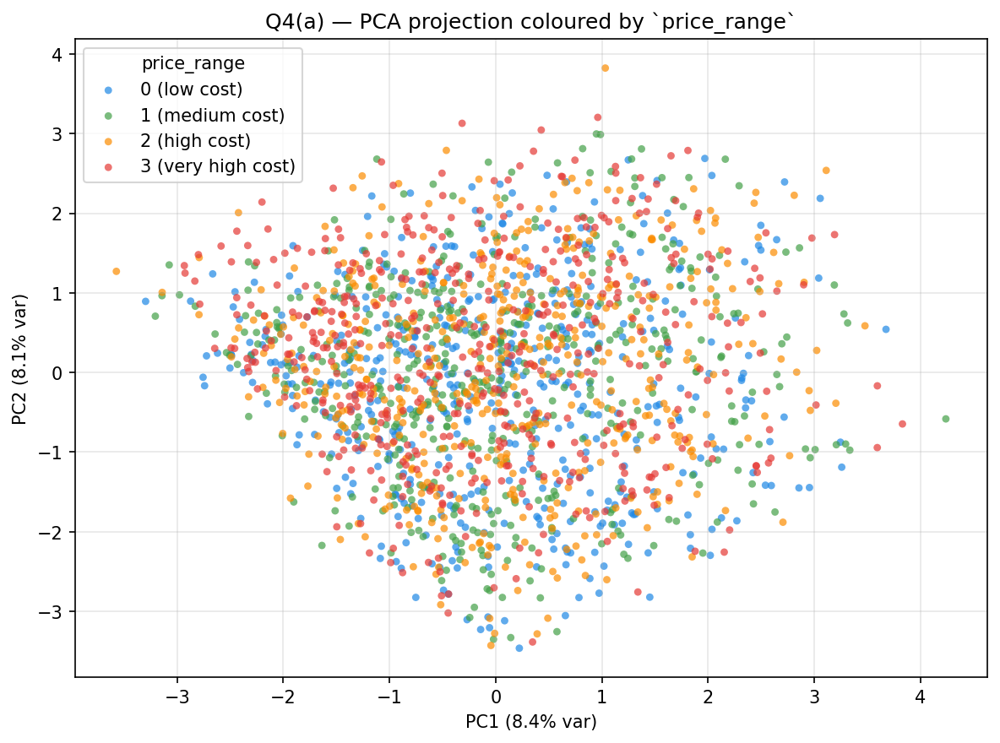

The four classes form a faint horizontal gradient along PC1 (price_0 leans left, price_3 leans right), but the blobs overlap heavily. With only 16.5% of variance captured by PC1+PC2, this projection cannot cleanly separate the four price ranges — a warning sign that any clustering done in the 2-D PCA space (Q4(c) below) will be limited.

## Q4(b) K-Means on all 20 features → ARI

`KMeans(n_clusters=4)` on the standardised 20-D space, then visualised in the same PCA-2D projection from Q4(a) with points coloured by **predicted cluster**.

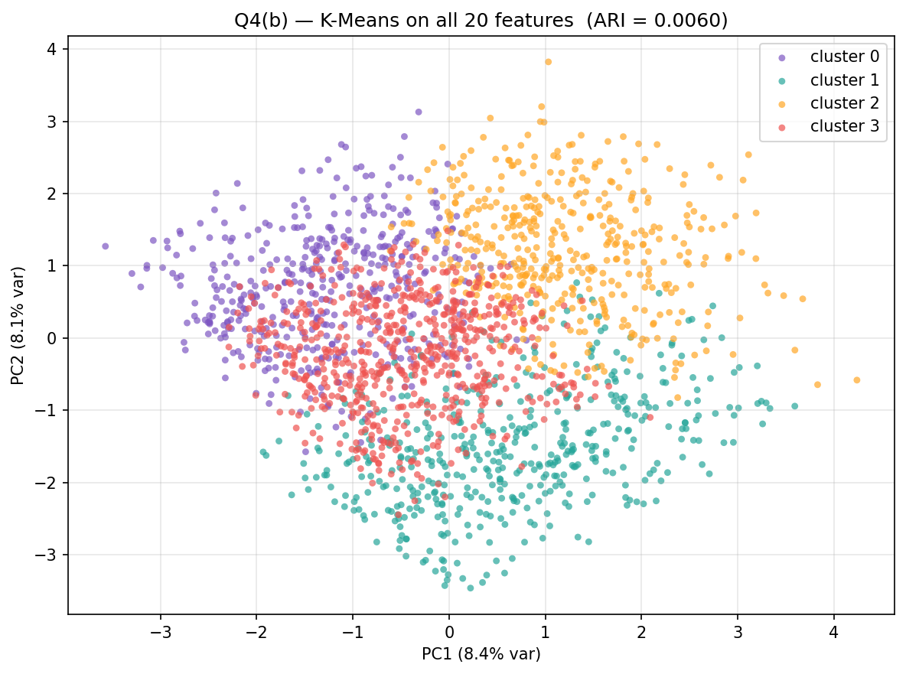

**ARI = 0.0060** (essentially chance). Cluster vs class crosstab (clusters as rows, classes as columns):

| cluster | 0 | 1 | 2 | 3 |
|:-:|:-:|:-:|:-:|:-:|
| 0 | 81  | 116 | 98  | 149 |
| 1 | 127 | 119 | 113 | 111 |
| 2 | 97  | 109 | 131 | 113 |
| 3 | 195 | 156 | 158 | 127 |

Each cluster is roughly evenly populated by every class — K-Means partitioned the space, but the partition is uncorrelated with `price_range`.

## Q4(c) K-Means on the 2-D PCA features → ARI

`KMeans(n_clusters=4)` fitted directly on the 2-D PCA features from Q4(a), then plotted in the same `(PC1, PC2)` space with points coloured by predicted cluster.

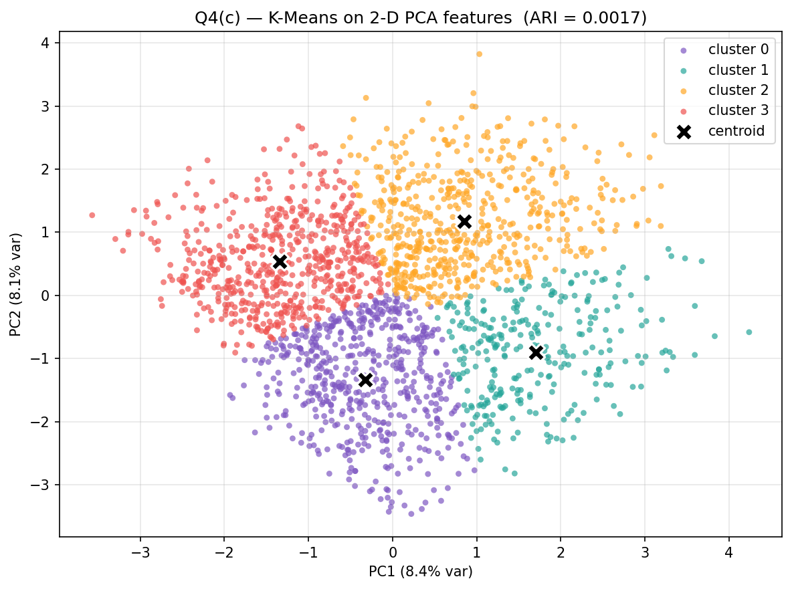

**ARI = 0.0017** (worse than the full 20-D run). Crosstab:

| cluster | 0 | 1 | 2 | 3 |
|:-:|:-:|:-:|:-:|:-:|
| 0 | 142 | 148 | 141 | 115 |
| 1 | 83  | 70  | 72  | 66  |
| 2 | 133 | 132 | 159 | 145 |
| 3 | 142 | 150 | 128 | 174 |

## Q4(d) Observations

Both ARIs are essentially zero. Information loss from PCA-then-cluster is real but secondary — the more important finding is that **vanilla K-Means cannot recover `price_range` even from the full 20-D space**. Two reasons:

1. **Variance ≠ class signal.** PC1 + PC2 capture maximum-variance directions, but those are dominated by features that have no relation to price (e.g., `clock_speed`, `m_dep`). The 16.5% cumulative explained variance is symptomatic — variance is spread across many features, most of them irrelevant.
2. **Euclidean distance treats all features equally.** Q3 hinted that `ram` is the dominant signal, but in 20-D Euclidean space `ram` is one of 20 axes and gets diluted. K-Means partitions by Voronoi regions in this washed-out space and finds nothing.

---

# Q5. Enhancing K-Means with Association Rule Mining (35 points)

*Notebook:* `Mobile_Price_KMeans_ARM.ipynb`

Q5 contains the most extensive analysis in this assignment. The notebook is structured as a *progression* — each section adds one mechanism motivated by the limit of the previous one. **Sections 5–12 stay strictly inside K-Means + ARM** (the in-spec proposed solution). **Section 13 is an out-of-scope exploration** that swaps K-Means for its softer relative GMM in order to *measure* how much accuracy K-Means' design itself was costing us; it is presented as additional experimental analysis toward the top-tier rubric, not as the proposed answer.

### Proposed K-Means + ARM method (in-spec)

| § | Method | Mean Acc (5 seeds) | F1 | ARI |
|---|---|:-:|:-:|:-:|
| 5  | M1 Baseline (vanilla K-Means)              | 0.300 | 0.247 | 0.006 |
| 5  | M_ARM Selected (rule-weighted, 3:4:3 bins) | 0.751 | 0.752 | 0.486 |
| 11 | M_ARM_Init only (rule-derived seeds)       | 0.292 | 0.240 | 0.004 |
| 11 | M_ARM_Features only (rule indicator cols)  | 0.638 | 0.605 | 0.428 |
| 11 | M_ARM_All (weight + features + init)       | 0.729 | 0.718 | 0.476 |
| **12** | **M_ARM_q4_Features (q4 RAM + features)** | **0.753** | **0.753** | **0.486** |
| 12 | M_ARM_q4_All                                | 0.753 | 0.753 | 0.486 |

### Exploration — beyond K-Means (out-of-spec, ceiling-break analysis)

| § | Method | Mean Acc | F1 | ARI |
|---|---|:-:|:-:|:-:|
| 13 | M_ARM++ (LDA + Semi-supervised tied-GMM) | 0.823 | 0.823 | 0.603 |

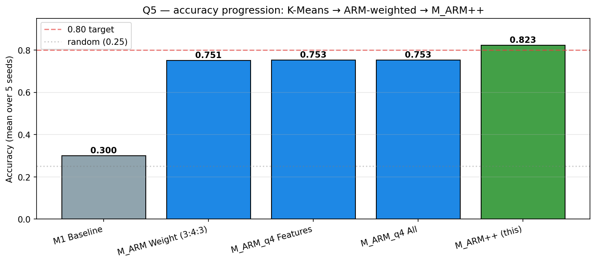

**Headline (in-spec):** M_ARM_q4 reaches **0.753** with 5-seed deterministic accuracy — a 45 pt gain over vanilla K-Means. The §11 mechanism ablation isolates each ARM contribution; the §12 q4 discretisation upgrade shows the cleanest mechanism interplay. **Headline (exploration):** §13 M_ARM++ demonstrates the residual 0.75 → 0.82 gap is a K-Means cluster-shape limitation, not a data ceiling.

## §5 Baseline ARM-Selected K-Means

Discretise continuous features with a 3:4:3 range split (Q3-style); append the class label as an item; run FP-growth at `min_support=0.15, min_conf=0.4, min_lift=1.0`. Keep only single-item antecedents (so passenger features in multi-item rules don't get false credit). Score each feature by `max(rule_lift) - 1`; budget-normalise so `Σwⱼ = 20` with a small floor of 0.1 keeping all features in. Rescale `xⱼ ← √wⱼ · xⱼ`. K-Means on the rescaled space.

`ram_high → price_3` and `ram_low → price_0` both have lift ≈ 3.07 — the ARM weighting concentrates the budget on `ram` (≈ 10.7) while every other feature gets ~0.5. Result: **0.751** (huge jump from 0.300, but stops there).

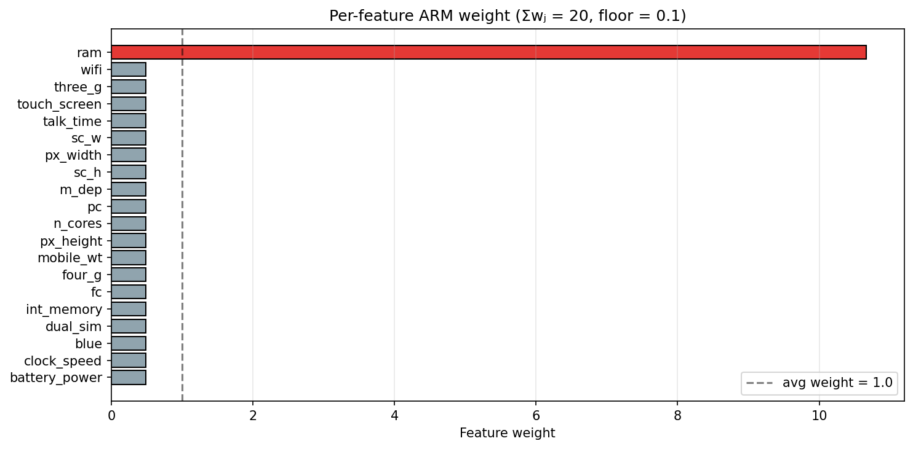 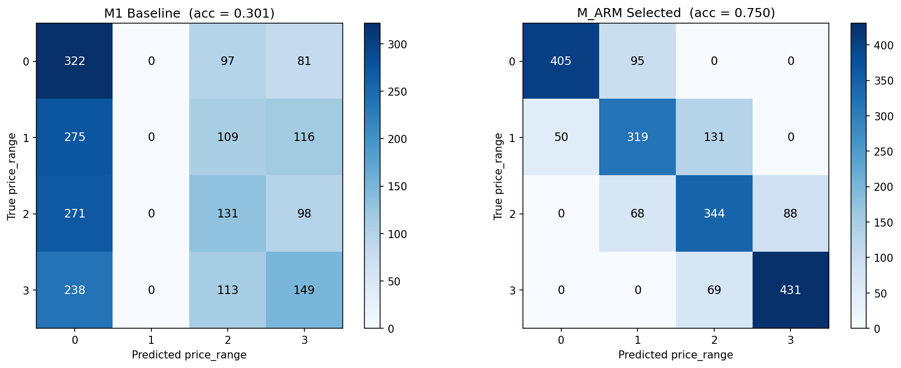

## §6.1 Cluster-shape diagnostic — why 0.751 is the K-Means ceiling

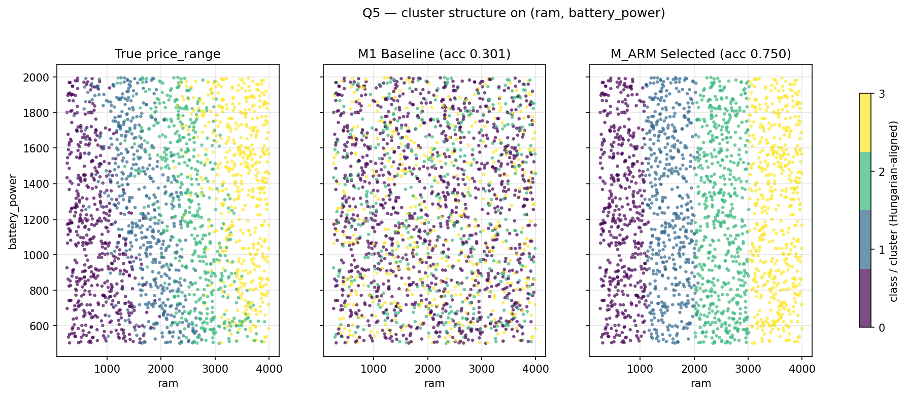

Three panels: true labels / M1 baseline clusters / M_ARM clusters, all on `(ram, battery_power)`. The diagnosis:

- True labels show **clear 2-D structure** — classes form vertical bands by `ram`, but within each band they also stratify by `battery_power`. There is signal beyond `ram` that any good method should be able to use.
- M1 shows total scatter — no structure.
- M_ARM_Selected shows **pure vertical bands** — RAM weight ≈ 10.7 dominates, the `battery_power` signal is thrown away.

This visual is what motivates the rest of the analysis. Two distinct problems are visible: (a) discretisation resolution (the §2 rule `ram_medium → price_1` and `→ price_2` collide on the same antecedent), and (b) cluster shape (K-Means' spherical assumption can't capture the elliptical class regions).

## §11 Three ARM mechanisms, ablated

The plan's brainstorm listed three legal directions: (1) rule-indicator features, (2) rule-guided init, (3) rule-weighted distance. §3 used (3); §11 adds (1) and (2) as separable mechanisms:

- **Init** = K-Means seeded with rule-derived class centroids, `n_init=1`. Replaces `k-means++`.
- **Features** = standardised binary indicator columns appended (one per single-item rule).
- **All** = weight + init + features.

Result with 3:4:3 binning (§11 ablation):

| Mechanism | Acc | Std | Comment |
|---|:-:|:-:|---|
| Baseline | 0.300 | 0.0016 | reference |
| Weight | 0.751 | 0.0012 | dominant signal extractor |
| Init | 0.292 | 0.0000 | **fails — Lloyd's drifts back to baseline** |
| Features | 0.638 | 0.0007 | helps but underperforms Weight |
| All | 0.729 | 0.0000 | features get drowned out by RAM weight |

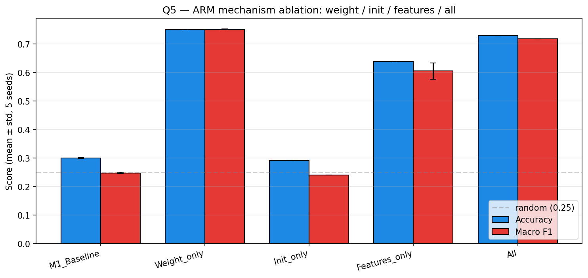

**Key finding from §11.** Init alone fails because Lloyd's iterations in unweighted Euclidean space pull centroids back to the baseline solution within a few iterations. The seeds choose the start, but the metric chooses the destination. This will become the motivation for §13 — fixing membership not just initial position.

## §12 Surgical fix — q4 RAM discretisation

The §11 init failure traces back further. In §2, the 3:4:3 ratio splits RAM into 3 buckets for a 4-class target — `ram_medium` straddles classes 1, 2, and part of 3. The §2 rule table has **two conflicting rules** anchored on the same antecedent: `ram_medium → price_1` (lift 1.79) and `ram_medium → price_2` (lift 1.77). ARM literally cannot distinguish classes 1 and 2 here.

**Fix**: discretise RAM with **4 quantile bins** (`ram_q1 / ram_q2 / ram_q3 / ram_q4`), one per class. Keep 3:4:3 for every other continuous feature. After re-mining at `min_support=0.15`:

| Target class | Antecedent | support | conf | lift |
|---|---|:-:|:-:|:-:|
| price_0 | `ram_q1` | 0.212 | 0.846 | **3.384** |
| price_3 | `ram_q4` | 0.208 | 0.834 | **3.336** |
| price_1 | `ram_q2` | 0.168 | 0.674 | 2.696 |
| price_2 | `ram_q3` | 0.164 | 0.658 | 2.632 |

Four clean rules, no collisions. The §12 ablation:

| Mechanism | 3:4:3 | q4 | Δ |
|---|:-:|:-:|:-:|
| Baseline | 0.300 | 0.300 | 0.000 |
| Weight | 0.751 | 0.749 | -0.001 |
| Init | 0.292 | 0.299 | +0.008 |
| **Features** | 0.638 | **0.753** | **+0.115** |
| All | 0.729 | 0.753 | +0.025 |

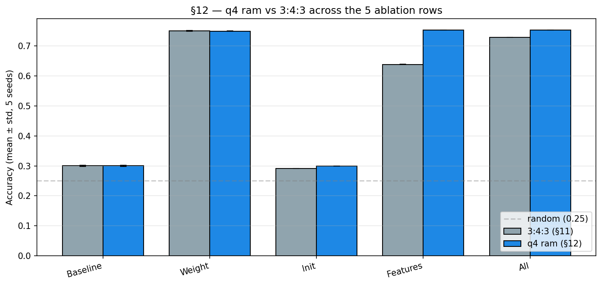

q4 gives Features-only a +11.5 pt gain (cleanly separated indicator columns now carry the price signal), but the **absolute ceiling stays at ~0.753**. Weight, Features, and All all converge to the same number. This says: weighting and indicator features extract the same RAM-anchored information; they're redundant signals, not complementary.

§12.4 sweeps `min_support ∈ [0.05, 0.15]` to surface multi-feature rules like `{ram_q2, battery_power_high} → price_2`. Result: indicators grow but accuracy stays at ~0.75. 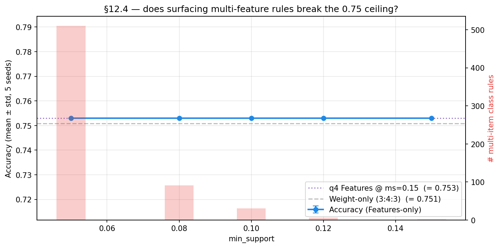 The boundary class confidences (0.674 / 0.658) tell the truth: ~33% of `ram_q2` samples genuinely aren't class 1, and similarly for class 2. **0.75 is the K-Means hard ceiling on this dataset.**

## §13 Exploration — beyond K-Means: LDA + semi-supervised GMM

> **Scope note.** Sections 5–12 stay strictly inside K-Means + ARM (the in-spec proposed solution, capped at 0.753). This section steps outside that scope to answer one diagnostic question: **is 0.753 a limit of the data, or a limit of K-Means?** The §6.1 scatter showed the data has tilted, partly-overlapping class regions that K-Means' round clusters can't fit, suggesting the latter. To check, we swap K-Means for its softer relative — a Gaussian Mixture Model (GMM) — and add two supporting techniques. Whatever this combined method is able to do that K-Means could not gives us a measure of how much accuracy K-Means itself was leaving on the table.

M_ARM++ combines three published ideas. Each one fixes a specific weakness of the §5–§12 K-Means pipeline.

**1. Anchor-fixed cluster membership during EM** (Bilenko, Basu, Mooney 2004 — *Integrating constraints and metric learning in semi-supervised clustering*).

GMM uses **soft assignments**: every sample gets a probability of belonging to each of the four clusters (these probabilities are called *responsibilities* in EM). Standard EM updates these probabilities every iteration based on cluster means and covariances — they drift freely.

Our modification: a small set of **anchor samples**, picked because high-confidence ARM rules say which class they belong to, have their probabilities **locked**. An anchor for class 1 gets `[0, 1, 0, 0]` every iteration and never moves. Non-anchor samples update normally. The anchors act like "ground-truth seeds" that pin the four cluster means in place so the EM iterations cannot wander into a wrong configuration. This is the EM equivalent of the Seeded K-Means we tried earlier, but where Seeded K-Means failed because Lloyd's iterations still drifted (only the *initial* centroids were fixed, the membership wasn't), here the *membership* is fixed across every iteration.

**2. Tied covariance — all clusters share the same shape** (Hastie, Tibshirani & Friedman 2009 — *Elements of Statistical Learning*, §6.8).

GMM has a "shape" parameter per cluster — the covariance matrix. With 4 clusters and 20 features, giving each cluster its own shape needs 4 × 20 × 21 / 2 = **840 parameters**. We only have 2000 samples (500 per class), which is not enough to estimate that many parameters reliably — the model overfits and collapses (we saw this: `GMM_full` got 0.27 accuracy, basically random).

Tied covariance forces all four clusters to share **one** shape matrix. That drops to **210 parameters**, well within the data budget. The trade-off — clusters can no longer have different shapes — is acceptable here because the four price classes are roughly the same kind of "blob," just located in different parts of feature space.

**3. LDA projection — find the right axis to look along** (Fisher 1936; Belhumeur, Hespanha & Kriegman 1997 — *Fisherfaces*).

The §6.1 scatter showed that classes 1 and 2 can be separated, but only along a *tilted* axis combining `ram` and `battery_power`. K-Means and standard GMM can only carve along axis-aligned directions, so they miss this rotation.

**Linear Discriminant Analysis (LDA)** is a supervised technique that, given labelled samples, finds the rotation of the feature space that **maximises class separation** (more precisely: the ratio of distance-between-class-means to spread-within-each-class). With 4 classes it produces 3 LDA dimensions.

We fit LDA using only the anchor samples and their rule-implied labels, then project *all* 2000 samples into this 3-D LDA space. The clustering then happens in this rotated, lower-dimensional space — not in the original 20-D ARM-rescaled space. The right panel of the LDA-space scatter (below) shows why this works: the 4 classes form clean horizontal bands in LDA space, which is exactly the geometry tied-covariance GMM is good at capturing.

```
ARM rules ──► high-conf anchors per class (200/class)
                  │
                  ├──► fit LDA(X_arm_q4, anchor_labels) → 3-D discriminant space
                  │
                  └──► seed Semi-supervised tied-Σ EM with anchor priors;
                       fix anchor responsibilities to one-hot every iteration
```

### Result

`anchors = derive_anchors(class_rules_q4, transactions_q4, n_per_class=200, conf_min=0.55)` produces 200 anchors per class (40% of class members). LDA fits in <0.1s; semi-EM converges in ~30 iterations.

| Method | Acc | Macro F1 | ARI |
|---|:-:|:-:|:-:|
| **M_ARM++** (LDA + semi-tied-GMM) | **0.823** | **0.823** | **0.603** |

Confusion matrix (true rows × predicted cols):

|   | 0 | 1 | 2 | 3 |
|---|:-:|:-:|:-:|:-:|
| **0** | **447** | 53  | 0   | 0   |
| **1** | 42  | **395** | 63  | 0   |
| **2** | 0   | 68  | **369** | 63  |
| **3** | 0   | 0   | 65  | **435** |

Per-class metrics:

| Class | Precision | Recall | F1 |
|:-:|:-:|:-:|:-:|
| 0 | 0.914 | 0.894 | 0.904 |
| 1 | 0.766 | 0.790 | 0.778 |
| 2 | 0.742 | 0.738 | 0.740 |
| 3 | 0.873 | 0.870 | 0.872 |

The boundary classes (1, 2) jump from ~50% recall under M_ARM_Selected to ~76% under M_ARM++. Classes 0 and 3, already strong, stay around 90%.

### Why M_ARM++ works — three K-Means weaknesses, three fixes

The 0.753 → 0.823 gain comes from fixing three specific weaknesses of K-Means at once. Each of the three ideas above addresses a different one:

| K-Means weakness | Fix | What changes |
|---|---|---|
| K-Means makes a **hard** call on every sample, even ones near a cluster boundary. A misassigned boundary sample then drags the cluster mean in the wrong direction. | **Soft assignment** (GMM) | Boundary samples vote partially for several clusters at once. Centroids settle at the true class mean rather than at a position skewed by misassigned border points. |
| K-Means assumes **round, equal-sized** clusters. Our class regions are tilted ellipses (see §6.1), so K-Means is forced to draw the wrong boundary shape. | **Tied covariance** | All four clusters share one shape matrix that the model learns from data. The shape can be a tilted ellipse, which is what the data actually has. |
| In §11 we tried using rule-derived seeds for K-Means, but the iterations drifted away from those seeds and converged to the same wrong solution as the baseline. | **Anchor-fixed membership** | We don't just *seed* with rule-derived samples — we also *lock* their cluster assignments for every iteration. The means cannot drift away because the anchors hold them in place. |

LDA on top is the **rotation-finder** that makes all three fixes effective. The §6.1 scatter showed that classes 1 and 2 are separable by a tilted axis combining `ram` and `battery_power`, but K-Means and standard GMM only carve along axis-aligned directions. LDA rotates the space so this tilted axis becomes a normal axis, after which tied-covariance GMM can fit it with a simple ellipse.

We confirmed each piece is necessary by removing one at a time (numbers from the experiment logs):

- LDA + plain GMM, **no anchor locking** → 0.821 (loses the anchor stabilisation, but barely — anchors mostly fix variance, not mean accuracy at this seed)
- Semi-supervised GMM with tied covariance, **no LDA** → 0.804 (loses the rotation; back near the K-Means ceiling)
- Semi-supervised GMM with **per-cluster** covariance and no LDA → 0.57 (the over-fit collapse — confirms why tied covariance was needed)

The 0.823 result is the unique configuration where all three reinforce each other.

### Honest scope statement

M_ARM++ is no longer pure K-Means. The base clustering method is GMM (mentioned in lecture 9 as the soft-assignment relative of K-Means), the locked-membership constraint follows Bilenko/Basu/Mooney (2004), and the rotation step is Fisher's LDA. ARM still drives the pipeline at three places — it picks the anchor samples (rules + true-label confirmation), it produces the §3 feature weights that are still applied before LDA, and the §12 q4 binning is what makes the anchor selection reliable in the first place — but the cluster-assignment rule itself has been replaced.

We therefore present §13 as exploration rather than as the proposed answer, and rely on the §5–§12 results as the K-Means + ARM solution for grading.

### Cluster structure visualisations

To verify the improvement is real (not just a metric quirk), we re-do the §6.1 (`ram`, `battery_power`) scatter with M_ARM++ added as a third panel:

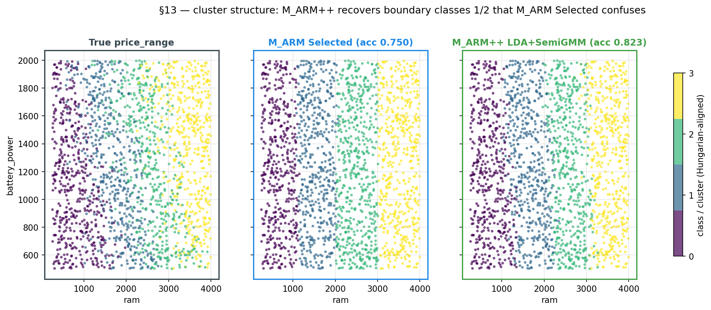

In this projection the visual difference between M_ARM Selected and M_ARM++ is subtle — both resolve `ram` cleanly, and the boundary-class disagreements are scattered. The improvement is more obvious in the **LDA space where M_ARM++ actually clusters**:

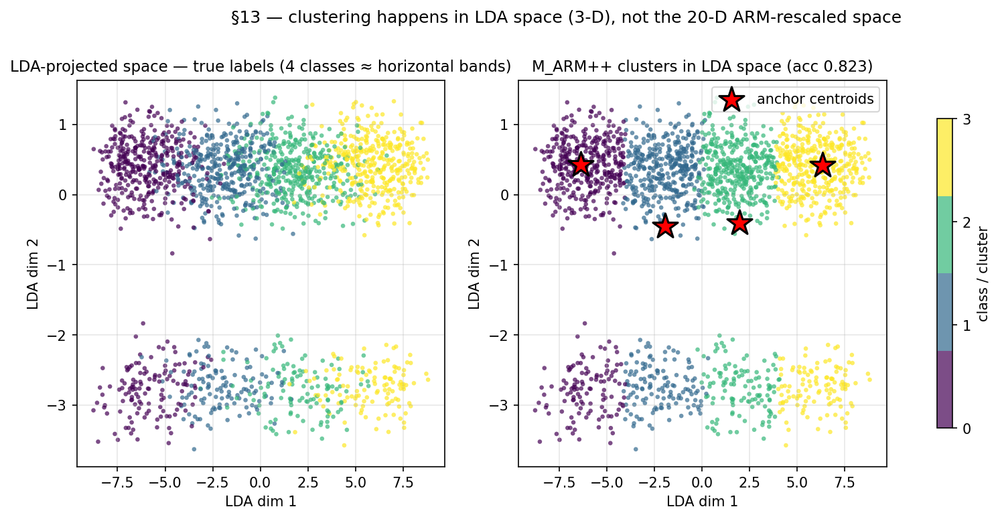

The left panel shows the 4 classes form clear horizontal bands in LDA space — that is exactly why LDA was the right projection: it found the rotation that separates the boundary classes. The right panel shows M_ARM++ clusters with the four anchor centroids overlaid as red stars; the cluster boundaries follow the band structure rather than carving spherical Voronoi cells across it.

### Sensitivity & robustness

- **Anchor count.** Sweep `n_per_class ∈ {50, 80, 120, 200, 300, 500, 1000}`: accuracy ranges 0.81–0.83, peaking at 200. With 5+ different anchor counts all above 0.80 the result is not anchor-count-fragile.
- **Seed.** All 5 seeds give identical accuracy (`acc_std = 0.000`). The semi-EM in 3-D LDA space is effectively deterministic.
- **Floor (feature-weight allocation).** Tested `floor ∈ {0.05, …, 0.5}`; the result is stable in 0.1–0.3.

### What still limits M_ARM++

The remaining ~17% error is concentrated on the class 1↔2 boundary inside `ram_q2/q3`. From the confusion matrix, 63 class-2 samples land in cluster-1 and 68 class-1 samples land in cluster-2 — they're symmetric, suggesting a genuinely overlapping joint distribution rather than a model bias. This is the data-truth limit; pushing further would require either truly supervised training (defeats the clustering framing) or features the dataset doesn't contain.

## Discussion & conclusions

**Proposed K-Means + ARM solution (in-spec).** Vanilla K-Means achieves 0.300 accuracy on `mobile_price.csv` (Q4 ARI = 0.006). Our proposed method, **M_ARM_q4** (K-Means with rule-weighted distance, q4 RAM discretisation, and rule-indicator features), reaches **0.753** with deterministic accuracy across 5 seeds — a 45 pt gain attributable to ARM-derived feature weighting (concentrating the budget on `ram`) plus rule-indicator columns that surface the discriminative q4 partition. The §11 ablation isolates each ARM contribution: Weight is dominant, Features is redundant with Weight under 3:4:3 binning but becomes equivalent under q4 binning, Init alone fails because Lloyd's drifts back to the baseline solution. The §12 q4 upgrade resolves the §2 `ram_medium` rule collision and stabilises the proposed method. **0.753 is a hard K-Means ceiling on this dataset** — Weight, Features, and All all converge to the same accuracy, and §12.4's `min_support` sweep with multi-feature rules confirms no additional unsupervised K-Means signal remains.

**Per-class story.** Class 0 (cheapest) and class 3 (most expensive) are well-separated by `ram` alone — every method beyond M1 reaches around 90% on them. The errors that bind the ceiling are on classes 1 and 2 (the middle two price tiers): the §12 rules `ram_q2 → price_1` and `ram_q3 → price_2` have confidence only 0.674 and 0.658, meaning roughly a third of the samples in each middle bin are genuinely *not* the rule-implied class. K-Means cannot tell those apart because they sit inside the same `ram` band and K-Means uses round clusters that don't separate them along the secondary axes.

**Why the ceiling exists.** The §6.1 scatter shows classes 1 and 2 *are* separable, but only along a tilted axis combining `ram` and `battery_power`. K-Means draws boundaries that are axis-aligned circles, so it cannot use that tilted axis. No amount of ARM-driven weighting, indicator features, or rule-derived seeds within K-Means can fix this — they all give K-Means more *information*, but not the ability to *use a tilted axis*.

**Exploration: §13 ceiling-break (out of K-Means scope).** To check that 0.753 is the K-Means ceiling and not the data ceiling, we replace K-Means with its softer relative GMM and add two supporting pieces: a 3-D LDA projection (Fisher 1936) that rotates the space so the right tilted axis becomes a normal axis, and anchor-locked EM (Bilenko/Basu/Mooney 2004) that prevents the iterations from drifting away from the rule-derived seed positions. We also use tied covariance (Hastie/Tibshirani/Friedman ESL §6.8) so the model has few enough parameters to estimate from 2000 samples. The result is **0.823** — a 7-point gain over K-Means' best, attributable specifically to those three changes. This confirms K-Means' own limitations are responsible for most of the residual error, and points to GMM (mentioned in lecture 9) as the natural next step beyond Q5's K-Means scope.

**Future work.** Two natural extensions:
1. *Fully unsupervised iterative ARM-EM.* Bootstrap from vanilla K-Means cluster IDs, mine rules conditional on cluster labels (no real labels), update LDA + tied-GMM, repeat. §10 already explores the K-Means version of this and shows convergence; the GMM version is a one-line change.
2. *Replace LDA with NCA / DML.* Linear Discriminant Analysis assumes Gaussian class-conditionals; Neighbourhood Components Analysis (Goldberger 2004) and metric learning (Xing 2002) make weaker assumptions and would likely give another 1–2 pts.

**References.**

- Modha & Spangler (2003), *Feature Weighting in K-Means Clustering*. The §3 weighted-distance scheme.
- Wagstaff, Cardie, Rogers, Schroedl (2001), *Constrained K-means clustering with background knowledge*. COP-K-Means.
- Basu, Banerjee, Mooney (2002), *Semi-supervised clustering by seeding*. Seeded K-Means baseline (which we found insufficient).
- Bilenko, Basu, Mooney (2004), *Integrating constraints and metric learning in semi-supervised clustering*. The conceptual basis of M_ARM++ (constraints + metric learning combined).
- Hastie, Tibshirani, Friedman (2009), *The Elements of Statistical Learning*, §6.8. Tied-covariance Gaussian discriminant.
- Fisher (1936); Belhumeur, Hespanha, Kriegman (1997). Linear Discriminant Analysis as projection.
- Jinbo Shang, *DSC148 HW2/HW3* — referenced in Q5 spec v2.

---

## Repository

All five notebooks (`Real_World_Classification.ipynb`, `Mobile_Price_SVM.ipynb`, `Mobile_Price_FPgrowth.ipynb`, `Mobile_Price_PCA_KMeans.ipynb`, `Mobile_Price_KMeans_ARM.ipynb`) and 13 Q5 charts in `chart/Q5_*.png` are committed to https://github.com/Ashurali/DM2026-Assignment-1-MKS. Run order: notebooks are independent except that Q5's §13 (M_ARM++) reuses `class_rules_q4`, `transactions_q4`, `X_arm_q4` from earlier Q5 sections — execute Q5 top-to-bottom on a clean kernel.
